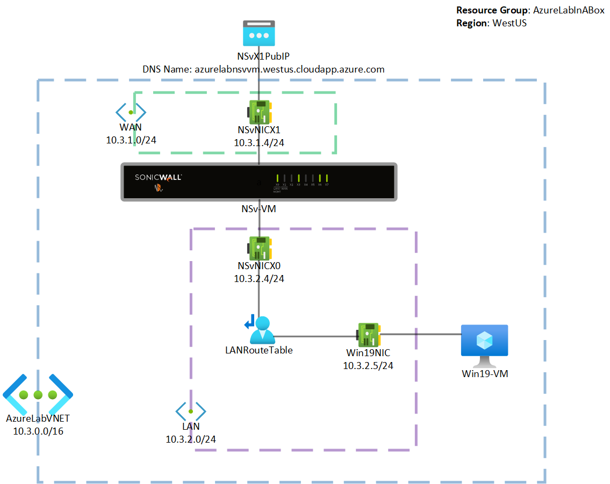

# Azure Lab In A Box
Last Updated: 05/12/21

## Description
This project is an easy to deploy SonicWall NSv Azure Lab environment. The Azure ARM template will create an NSv and Windows VM sitting behind the NSv firewall (along with all of the necessary associated resources).  
 
For production deployments, please visit https://github.com/sonicwall

## Topology

## Deployment Instructions
<ol>
  <li>
    <h3>Deploy Template to Azure </h3>
    
      
  </li>
  <li>
 <h3>Create or Select a Resource Group</h3>
This Resource Group will store all of the resources for this lab environment.

 
  </li>
 <li><h3>Populate the fields</h3>
 
                                                     <b>Region</b>: The set of datacenters that the resources will reside 
                                                     <b>Lab Name</b>: The name of the lab.  This name will be prepended to many of the resources created.  Please use a unique lab name. 
                                                     <b>Management IP</b>: The public IPv4 address that will be used to access the lab environment.  This restricts access to the lab environment to only this public IP address.  
                                                     <b>NSv Version</b>:  Select the NSv version - Generation 6 or Generation 7 for this lab deployment. 
                                                     <b>SSH Username and Password</b>: This is used for both SSH access for the NSv and RDP access for the Windows VM.           
 
<li><h3>Log Into the NSv</h3>
  Navigate to your "NSv-VM" from your Resource Group and copy the DNS Name.  With DNS Name or Public IP address, log into the NSv VM with another browser window. 
    
 
</li>
</li>
  <li><h3>Register the NSv</h3>
  Please register the NSv on <a href="https://www.mysonicwall.com">MySonicWall</a> or through the NSv management. 
 
  </li>                                       
  <li><h3>Add NAT Policy</h3>
  To Access the Windows VM, please create a NAT policy on the NSv. 
  <b>Public IP Address</b>: 10.3.1.5 
  <b>Private Server IP Address</b>: 10.3.2.5 
  <b>Service Port</b>: 3389 
   
  For more information, please follow this <a href="https://www.sonicwall.com/support/knowledge-base/how-do-i-configure-nat-policies-on-a-sonicwall-firewall/170505782921100/">KB article</a>
  </li>
  <li><h3>Remote Desktop to Windows VM</h3>
  At this point, you will be able to Remote Desktop into your Windows VM with the DNS Name in Step 4.  All traffic from your Windows VM will be passing through the NSv Firewall. 
 
</li>
</ol>

